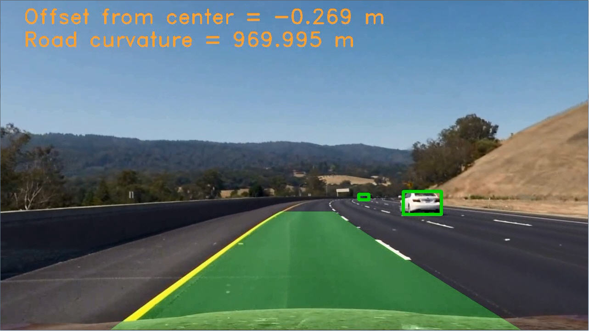
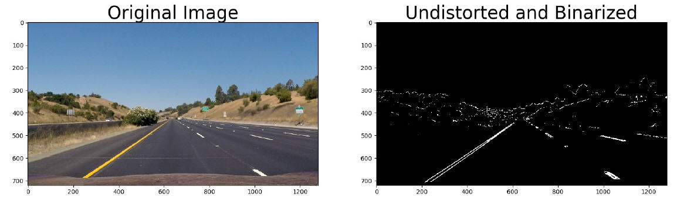
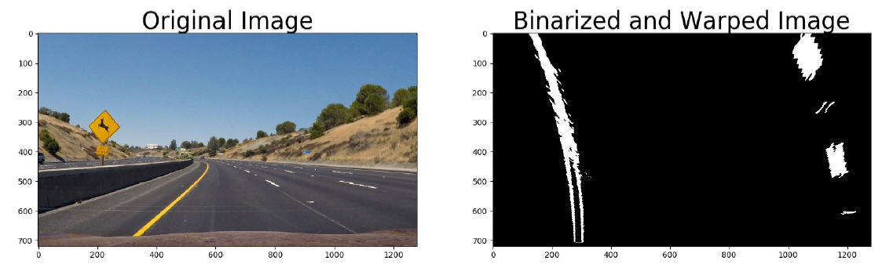
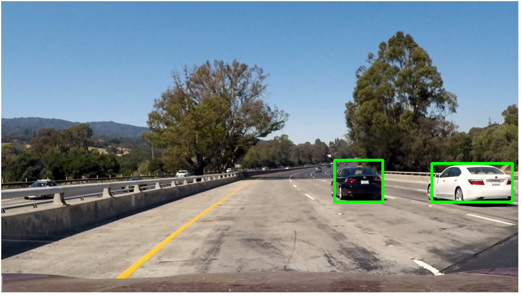
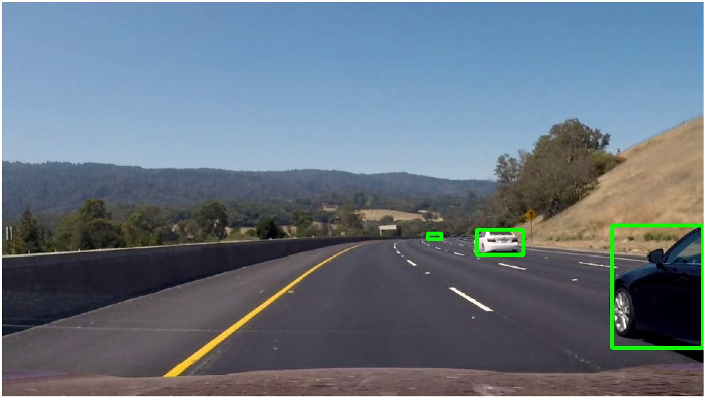

# Vehicle and Lane Detection
Final project of Udacity Self-Driving Car Term1

##Specifications
The goal of this project is to analyze a video taken by a vehicle front camera, recognize the current driving lane and detect other vehicles on the road. Additionally, we calculate the current road curvature and the lateral offset of the vehicle from the center of the lane.

##Implementation
The project is split in two parts: lane detection and vehicle detection. Detailed descriptions of the two implementations are available in the pdf files.

Lane detection briefly consists in the following functions:

- Camera calibration
- Thresholded binary image
- Perspective transform
- Line identification
- Geometrical calculations
- Inverse warping
- Moving average filter

After calibrating the camera to avoid distortions in the frame, we extract a binarized version of the image by filtering pixels intensities in several color spaces and by thresholding sobel gradients magnitudes and directions. The resulting binary image highlights the lane lines:

Then we use openCV perspective transformations to show a bird's eyes view of the road, which gives a 2D flat view of the lines and makes it much easier to work out their geometry. We analyze intensity histograms to detect points on the lines and fit a quadratic polynomial to calculate their curvature.

The polynomial fit is then unwarped back on the original frame.

For vehicle detection we use two different classifiers and compare their speed/accuracy performance. First we use a SVM trained on the HOG features of vehicles. Then we use an sdd network pre-trained on the COCO dataset and available in the Tensorflow Object Detection API.

The SVM approach is more complicated to implement: it requires the extraction of HOG features from the frame (we concentrate on the lower half only):

Then we slide windows of different sizes around the ROI and collect all positive detections. To avoid false positives and multiple detections we build a heat map and threshold it. The results are good enough, but the process is slow.

 
We decided to try with CNN, SDD in particular, since its implementation and pre-trained weights are freely distributed with the Tensorflow API. The algorithm runs a bit faster than SVM, although we are still far from reaching real-time behavior.

A final video of lane and vehicle detection combined is available here: /* TODO */
